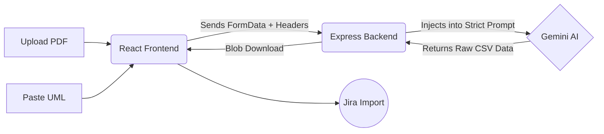

# 🚀 AI-to-Jira Tasks Converter


Welcome to the **AI-to-Jira Tasks Converter**! This full-stack application allows Agile Project Managers, Scrum Masters, and Developers to upload assignment PDFs and architecture UMLs, and instantly receive a completely mapped-out Jira migration CSV file—ready to be imported directly into Jira.

---

## ✨ Features

- **📄 PDF Ingestion:** Upload any standard assignment or specification PDF.
- **📊 UML Context Support:** Paste existing system architecture or Mermaid UML to give the AI context on the previous system structure.
- **🧠 Gemini AI Powered:** Utilizes the cutting-edge Google Gemini 2.5 Flash model for lightning-fast, intelligent breakdown of requirements.
- **🏗️ 5-Epic Hierarchy:** Automatically structures the project into a professional 5-Epic lifecycle (Administration, Data Layer, Business Logic, Validation, Containerization).
- **✅ TDD Ready:** Automatically splits functional requirements into Test-Driven Development (TDD) sub-tasks.
- **📥 One-Click Export:** Immediately download a strictly-formatted CSV that natively imports into Jira Cloud with zero formatting errors.

---

## 🛠️ How it Works



---

## 💻 Running Locally

To run this project on your local machine, follow these steps:

### 1. Prerequisites
Make sure you have [Node.js](https://nodejs.org/) installed on your machine.
You will also need a free **Google Gemini API Key**. You can get one from [Google AI Studio](https://aistudio.google.com/).

### 2. Clone and Install Dependencies

Open your terminal and install dependencies for both the frontend and the backend:

```bash
# Navigate to the backend folder and install dependencies
cd backend
npm install

# Open a new terminal, navigate to the frontend folder, and install dependencies
cd frontend
npm install
```

### 3. Setup Environment Variables

In the `backend` folder, create a file named `.env` and add your Gemini API key:

```env
GEMINI_API_KEY=your_actual_api_key_here
```

### 4. Start the Application

You need to run both the frontend and backend servers simultaneously.

**Start the Backend:**
```bash
cd backend
npm run dev
```
*(The backend runs on `http://localhost:3001`)*

**Start the Frontend:**
```bash
cd frontend
npm run dev
```
*(The frontend runs on `http://localhost:5173`)*

---

## 🌍 Production Deployment

This application is ready to be deployed to cloud platforms like Render, Vercel, or Railway.

Currently, the frontend is configured to talk to the live production backend:
`https://ai-to-jira.onrender.com/api/generate-jira-tasks`

If you are running the project **locally**, ensure your `App.jsx` points to `http://localhost:3001`.

---

## 📖 How to Use the App

1. **Open the App:** Navigate to the frontend URL (or `localhost:5173`).
2. **Upload a File:** Drag and drop your project specification PDF into the upload zone.
3. **Provide Context (Optional):** Once the file is uploaded, a text box will appear. Paste your existing system's UML, Mermaid chart, or old architectural notes here.
4. **Generate:** Click **Generate Jira CSV**. The AI will take about 10-20 seconds to process the documents.
5. **Download:** Click the green **Download CSV** button.
6. **Import to Jira:** 
   - Open your Jira project.
   - Go to `Issues` -> `Import issues from CSV`.
   - Upload your downloaded file and follow the Jira mapping wizard (map `Issue ID`, `Parent ID`, `Summary`, `Issue Type`, and `Description`).

---

## 📝 License
This project is open-source and available for educational and professional development purposes. Feel free to fork and expand!
